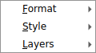
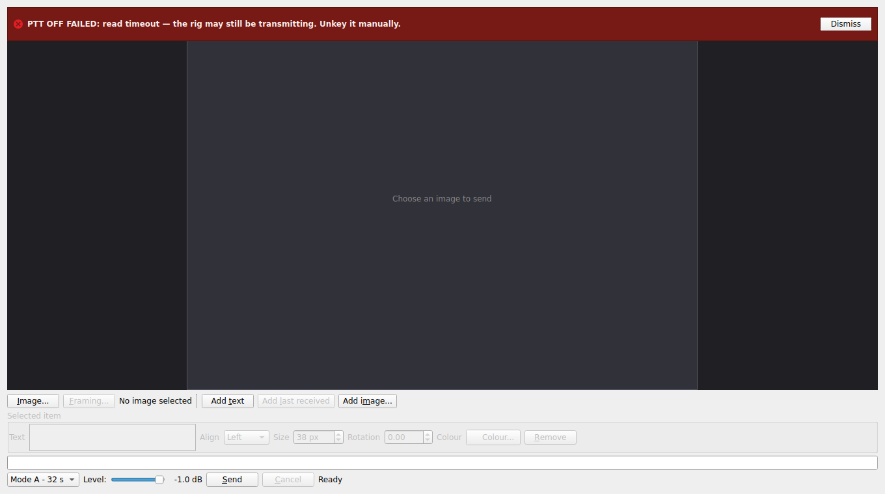

# GUI review — consistency and modern practice

2026-08-07. `docs/native-app.md`'s Phase 3 lists "look-and-feel review,
iterated" as the thing it needs eyes for. This is one pass of that.

> **Status, 2026-08-08 — most of this is done.** §1 (all six defects),
> §2 (the whole consistency sweep) and §5 (the duplication) are
> implemented, along with everything in §3 except the three items named
> below. Scope decided by Andrew:
>
> - **The "Selected item" row stays visible and disabled** (§1.1's first
>   option). `test_tx_panel.cpp` is the new guard: it asserts the control
>   strip's height across a select/deselect cycle, which is the property
>   the panes' equality actually rests on.
> - **Help text got both halves** (§3.1): `style::secondary_text` now
>   measures **5.07:1** where it measured 1.62:1, and the long notes are
>   behind `style::note_with_detail` disclosures.
> - **The tabbed layout is untouched** (§4). Only the stale numbers were
>   corrected — see below and in `CLAUDE.md`.
> - **§2.1's recommendation is reversed**: the sweep standardised on
>   **image**, not *picture*. It matches the `images::` namespace, the
>   folder settings and the file-dialog captions already, so it was both
>   the consistent choice and the smaller diff.
>
> Deliberately **not** done, and still open: the waterfall's fixed
> −95/−20 dB window and missing gain control (§3.5), the log pane's
> repeated date column, missing severity filter and filter-ignoring Copy
> (§3.12), and replacing the model-still-loading message boxes with
> disabled buttons (§3.9, first half — the `closeEvent` default *was*
> fixed). §3.8 stands as written: `tr()` is still paid for and no
> translator is installed.
>
> Re-measured after the work: side by side asks **766 x 467**, tabbed
> **342 x 464**.

## Before and after

Both pairs are `sstvae-gui-shot` output at the same size, so they differ
only by the changes.

The two panes at 1360x760 — before, then after. The transmit strip is
where most of §1 lands: "Rotation" separated from its spin box, an
invisible group separator, and a progress bar that read as a disabled
line edit.


The Transmit settings tab, which was the worst case for §3.1 — roughly
60% grey prose by area, at 1.62:1 contrast. After: 5.07:1, four short
summaries with disclosures, and each setting grouped with its own help.


**Method.** Built `native/` against Qt 6.4.2 and rendered every panel
and dialog headless with `sstvae-gui-shot`, at 1360x760 and 900x700, and
read all 7,109 lines of `native/gui/`. Everything below with a number in
it was measured off a render or off the tool's own output, not inferred
from the source. Nothing here is a bug in the modem, and nothing here is
a correctness bug — it is all what the operator sees.

**One thing to say first:** the hard problems in this GUI are already
solved. The equal-panes arithmetic holds (`strips: receive 166 transmit
166 (equal)`, `pictures: 641x537 / 641x537`), the picture boxes
letterbox correctly in both directions, the error tiering is right, the
threading rules are right, and the framing dialog is the best-designed
surface in the application. What follows is the layer above that.

---

## 1. Defects — visibly wrong on a render

### 1.1 The "Selected item" row hides itself, against its own written rule

`tx_panel.cpp:330` builds the properties box always-present-and-disabled
and says so:

> **Always present, disabled when nothing is selected** — not hidden. A
> row that appears on selection moves the picture under the cursor every
> time an item is clicked, which is the one thing a composing surface
> must not do.

`tx_panel.cpp:846` then does the opposite:

```cpp
properties_->setVisible(item != nullptr);
```

with a comment asserting the opposite rule. So the box is visible at
startup (confirmed on the render — the greyed "Text / Align / Size /
Rotation / Colour" row is on screen with nothing selected), and vanishes
the first time the operator clicks empty canvas.

Two consequences, and the second is the one that matters:

- The canvas jumps ~90 px every time a selection is made or dropped —
  under the pointer, mid-composition.
- **It breaks the equal-panes invariant.** `PaneContainer::equalise_strips`
  runs only from `set_control_strips` and `resizeEvent`. Nothing re-runs
  it when a strip's *content* changes height, so after the first click
  the two strips hold minimums computed for a layout that no longer
  exists and the two pictures stop matching until the window is resized.
  `test_pane_container.cpp` cannot catch this: its stand-in panes have
  static strips.

Pick one rule. Keeping the box always visible (what the comment argues,
and what I'd do) means deleting the `setVisible` line. Hiding it means
`equalise_strips()` has to be re-run on the change — expose it as a slot
and connect `OverlayEditor::selectionChanged` to it.

### 1.2 A label and its control separate across a line wrap

The properties row is a `FlowLayout` of alternating `QLabel` + control,
and the layout has no notion that they belong together. At 1360 px the
render shows **"Rotation" ending line 1 and its spin box starting line
2**, with "Size 0.010" between them on line 1 and "Colour" after the
orphaned spin box on line 2. At 900 px the same row wraps cleanly. So it
is width-dependent and looks fine at whatever size you last checked.

Fix: make each label+control pair one `QWidget` with its own `QHBoxLayout`
and add *that* to the flow. `settings_dialog.cpp`'s `row()` helper is
already exactly this function — it just is not used here.

### 1.3 The tool row's group separator does not render

`build_tool_row` adds a `QFrame::VLine` between the picture controls and
the overlay controls, and the comment describes it as the mechanism
carrying the grouping the old sidebar had:

> The groupings the column had (Picture / Overlay) are carried by
> separator lines rather than by boxes

It is not on screen at either width. `FlowLayout` lays every item out at
its own `sizeHint` rather than stretching it to the row height, and a
bare `QFrame`'s height hint is a few pixels — so the separator paints as
an invisible dot. The grouping the row is documented to have is not
communicated at all.

Fix: give the rule an explicit `setFixedHeight` matched to the row's
button height (or teach `FlowLayout` to stretch items whose vertical
policy is `Expanding`). It is worth having — without it "Picture… /
Framing… / No image selected / + Text / + Last RX / + Image… / Remove"
is one undifferentiated run of seven controls.

### 1.4 The transmit progress bar reads as an empty text field

Same widget, two panes, opposite presentation. Receive puts a
full-width `QProgressBar` on its own row (renders as a saturated blue bar
with "100%" in it). Transmit puts one inline in the send bar with
`QSizePolicy::Ignored`, where it renders as **a blank white rounded
rectangle between "Cancel" and "Ready"** — indistinguishable from a
disabled line edit. Confirmed at both widths.

Nothing on screen says that box is the transmission's progress, and the
transmission is the thing in this application you most want to watch.
Give it its own row in the strip, matching receive's.

### 1.5 The receive progress bar keeps its last value after Stop

`refresh_status()` returns early when not listening and `stop()` never
touches `progress_`. Press Stop mid-reception and the status line reads
"Stopped" above a bar still showing 63%. One line in `stop()`.

### 1.6 "Mode: Mode B - 64 s"

The send bar adds a `QLabel(tr("Mode:"))` in front of a combo whose items
are `tr("Mode %1 - %2 s")`. Drop one of them.

---

## 2. Consistency

### 2.1 "picture" and "image" are used interchangeably

16 user-facing strings say *image*, 14 say *picture*, for the same
object, often adjacent: the button is **Picture…**, the caption under it
is **No image selected**, the canvas says **Choose a picture to send**,
the receive button says **Save image**, the settings checkbox says
**Refine each picture before sending**, and the folders are **Received
images** / **Images to send**.

Pick one and sweep. **Settled on *image*** (Andrew, 2026-08-07), against
this section's original recommendation of *picture*. It is already what
the `images::` namespace, the folder settings and every file-dialog
caption say, so it was the smaller sweep as well as the consistent one.
The C++ type names and config keys are untouched — `images::Picture` is
still `images::Picture`; this is about what the operator reads.

### 2.2 Units are formatted four different ways

| where | renders | code |
| --- | --- | --- |
| SNR | `SNR 8.3dB` | `rx::fmt_snr`, `engine.cpp:185` |
| TX level | `-1.0 dB` | `tr("%1 dB")` |
| refinement gain | `~+2.4 dB` | `asprintf("~%+.1f dB")` |
| rig timings | `5.00 s` | `setSuffix(" s")` |
| receive timings | `5.00` + label `Decode every (s)` | no suffix |
| mode duration | `Mode B - 64 s` | `tr("Mode %1 - %2 s")` |

`SNR 8.3dB` is the odd one (no space before the unit) and it is the
number an operator reads most. It is also built in `core/rx/engine.cpp`
with the English word "SNR" baked in, so it is untranslatable and the
GUI concatenates it — `text += snr_text(...)`. Have the core return the
number and let the panel format it.

Within the settings dialog, "5.00 s" on the Rig tab and "5.00" +
"(s)" in the label on the Receive tab are the same quantity in the same
dialog with two conventions. Use `setSuffix(" s")` everywhere.

### 2.3 Settings notes are aligned two different ways — sometimes on one tab

`note()` text is added either as `form->addRow(note(...))` (spans both
columns, starts at x=22) or `form->addRow(QString(), note(...))`
(indented to the field column, x=138). Both appear across the dialog, and
**both appear on the Model tab**: "Leave blank for the published
model…" is full width and "fp16 is the default…" directly below it is
indented. Measured off the render.

Pick the indented form — it associates the note with the control above
it — and use it everywhere.

### 2.4 Field widths

`compact()` exists and is applied to the Rig tab's combos only.
Everywhere else a combo or spin box stretches the full field column: the
**Precision** combo is ~530 px wide to hold "fp16"; **Buffer (s)** and
**Decode every (s)** are ~480 px wide to hold three digits. Apply
`compact()` to every fixed-vocabulary combo and every numeric spin box.

### 2.5 Button labels

- **`Download All Models`** is the only Title Case label in the
  application. Everything else is sentence case. → "Download all models".
- **`Save image`** opens a file dialog and has no ellipsis, while
  `Picture…`, `Framing…`, `+ Image…`, `Colour…`, `Browse…`, `Folder…`,
  `File…` and `Settings…` all correctly carry one. → "Save image…".
- Three labels for the same gesture: **`Browse…`** (Folders tab),
  **`Folder…`** and **`File…`** (Model tab).
- `+ Text` / `+ Last RX` / `+ Image…` — the `+ ` prefix is not a Qt
  idiom, and `Last RX` is the only place the panes are called RX/TX
  rather than Receive/Transmit.

### 2.6 The log pane names things differently from the rest of the app

The filter combo offers `All, rig, rx, tx, opt, app` — lowercase jargon
beside a capitalised "All", for panes the window itself calls **Receive**
and **Transmit**. `opt` is not a word the operator has seen anywhere;
the feature is called "Refine each picture before sending".

Severity renders as `warn`, `info`, **`ERROR`** — two cases in one
column. And warnings are visually identical to info (only errors get
bold), so the middle tier has no surface at all.

### 2.7 Dash and separator conventions

`--` (typewriter double hyphen) is used for parenthetical dashes in
user-facing strings, ` - ` for field separators in the last-reception
card, and the two collide: the status label says **"Paused --
transmitting"** while the scrim painted over the waterfall two
centimetres above it says **"paused - transmitting"**. Settle on an em
dash (`QChar(0x2014)`) for parentheticals and something unambiguous —
`·` or `|` — for field separators.

### 2.8 Compound settings rows leave the first control unlabelled

`Baud / bits` is [combo] `Data` [combo] `Stop` [combo] — the first combo
is the baud rate, and you know that only from the row label. Same shape
on `Parity / handshake` and on `Poll / PTT timing`, where the first spin
box is the poll interval and the two after it are labelled `Lead` and
`Tail`. Label all three, or none.

### 2.9 Disabled-as-styling

`last_card_->setEnabled(false)` is used to make text read as secondary
(`rx_panel.cpp:159`), and `rig_label_->setEnabled(false)` to grey the rig
chip while polling is paused. Both are appearance changes expressed as a
state change: it removes the widget from the accessibility tree as an
interactive-but-unavailable element, and it is a third way of dimming
text alongside `note()`'s palette override and the log pane's bold.

`note()`'s palette approach is the right one. Lift it into a shared
helper and use it for all three.

---

## 3. Modern practice

### 3.1 The help text fails contrast, and it is the app's only documentation

`note()` colours text with `QPalette::Disabled, QPalette::WindowText`.
Measured off the Transmit tab render: the darkest glyph pixel is
`#bebebe` on `#efefef` — **1.62:1**. WCAG AA wants 4.5:1 for body text
and 3:1 for large text. Normal labels in the same dialog measure 18.3:1.

This is not decorative text. The ALC procedure, the beacon callsign
rules, the refinement explanation and the loopback recipe all live in it,
and the Transmit tab is roughly 60% grey prose by area.

Two changes:

1. Colour it from `QPalette::WindowText` blended toward the window
   colour by ~35%, or simply use the normal text colour at a smaller
   point size. Aim for ≥4.5:1 and verify with a render.
2. Stop showing all of it at once. Nine lines of prose for one checkbox
   is where progressive disclosure earns its keep — a one-line summary
   plus a "More…" expander, or a `?` info button. The two orphan
   paragraphs at the bottom of the Transmit tab about a control that is
   *not on that tab* are the clearest case.

### 3.2 Labels clip rather than elide — contradicting the project's own rule

`settings_dialog.cpp:130` states the principle:

> Clipping is worse than scrolling in both directions: the operator
> cannot tell whether the text is cut off or simply ends.

Six widgets carry `QSizePolicy::Ignored` horizontally so they cannot pin
the window's minimum width — the receive status line, the transmit status
line, the picture caption, the status bar's mirrored receive line, the
transmit progress bar, and the transmit properties text box. There are
**zero** uses of `elidedText` or `setTextElideMode` in `native/gui/`.
So the longest line the receive panel can produce ("Receiving mode C:
frame 220/220 (100%) SNR 8.3dB de KD8XYZ", ~400 px) is cut mid-word at a
narrow pane, and the operator cannot tell the callsign is missing rather
than absent.

`Ignored` is the right size policy; it just needs a `resizeEvent` that
sets the text through `QFontMetrics::elidedText(full, Qt::ElideRight,
width())`. A tiny `ElidingLabel` subclass would serve all four labels.

### 3.3 Pixel constants where font metrics or DPI belong

- `text_edit_->setFixedHeight(46)` (`tx_panel.cpp:442`) — "two lines",
  in pixels. At 150% font scaling that is one and a bit, and the second
  line is cut. Should be `fontMetrics().lineSpacing() * 2 + frame`. The
  project already does this correctly for `level_label_`'s minimum width
  and the log pane's minimum height.
- `constexpr int HANDLE = 10` (`overlay_editor.cpp:23`) — the resize
  grip, in logical pixels, never scaled. On a HiDPI panel that is a
  ~3 mm target. Scale it from `QFontMetrics` or
  `style()->pixelMetric(QStyle::PM_SmallIconSize)`.

### 3.4 Three danger reds, and one that fails on dark themes

| where | colour |
| --- | --- |
| PTT lamp text | `#b3261e` |
| error banner background | `#7a1f1a` |
| waterfall CLIP / over-level | `rgb(255,60,60)` |

Plus `rgb(90,220,120)` and `rgb(255,190,60)` for the meter's ok/warn.
These want to be one small table of semantic colours in a shared header
rather than five literals in three files — the same argument that made
`config.hpp` generated rather than hand-maintained.

The PTT lamp is the one with a real problem. It is bold `#b3261e` text on
the status bar's own background, chosen against a light theme; on a dark
theme that is dark red on dark grey. This is the one indicator in the
application that must be readable at a glance from across a shack. Make
it a filled chip — light text on a solid red rounded rect, painted from
the palette-independent pair — so it reads the same in both themes.

### 3.5 The waterfall has no gain control and a fixed dB window

`DB_FLOOR = -95`, `DB_CEIL = -20`, compiled in. A quiet soundcard, a
low-gain interface or an attenuated line renders the whole strip black,
and the operator's only recourse is the OS mixer. Every comparable
application (fldigi, WSJT-X, HDSDR) exposes at least a floor/contrast
pair. A simple auto-floor — track a rolling percentile of the spectrum
and offset `DB_FLOOR` to it — would need no UI at all and would fix the
common case. Keep the colour ramp: black→blue→green→yellow→white is the
genre convention and operators read it fluently, whatever a perceptual
uniformity argument says.

Also: no dB scale on the level meter and no reference marks, so "how
close am I to clipping" is readable only as a colour change at 85%.

### 3.6 Keyboard and pointer affordances

- **No shortcuts and no mnemonics on any panel control.** Only the menu
  bar has them. The two actions that key a radio (Send) and open the
  soundcard (Start receiving) have neither. At minimum: mnemonics on
  every panel button, and a shortcut on Send.
- **8 tooltips across ~30 controls.** Mode, level, Send, Cancel, Start,
  Stop, Autosave, the filename caption and every property field have
  none.
- **The overlay editor gives no hover feedback.** `setMouseTracking(false)`
  and the cursor never changes, so neither the draggable items nor the
  10 px corner grip announce themselves. `CropView` in the same
  application deliberately sets `Qt::SizeAllCursor` and explains why —
  the editor should do the same, plus `Qt::SizeFDiagCursor` over the
  grip.
- **The framing dialog carries a one-line instruction** ("Drag to
  reposition; the wheel or the slider zooms") and it works well. The
  overlay editor, which has drag, corner-resize, arrow-key nudge and
  Shift-coarse-nudge, has nothing.

### 3.7 The About box does not name the application's version

It reports Hamlib and Qt versions — correctly, and for good reasons — and
omits SSTVAE's own. `native/CMakeLists.txt:16` has `VERSION 0.3.0` and
it reaches the macOS bundle, but `QCoreApplication::setApplicationVersion`
is never called and `show_about()` never prints it. For a project whose
release page does not exist yet and whose bug reports will come from CI
artifacts, this is the single most important line in that dialog.

### 3.8 Every string is wrapped in `tr()` and no translator is ever loaded

`main.cpp` installs no `QTranslator` and there is no `.ts` file or
`lupdate` step. That is a fine place to be — but the *cost* of `tr()` is
being paid, and two habits are quietly making it unrecoverable:
sentences assembled by concatenation (`text += tr("  de %1")`,
`line += tr(", %1/%2 frames")`), which cannot be reordered by a
translator, and English generated below the GUI layer (`fmt_snr`,
`tx::phase_name`). Either add the translator plumbing or accept it and
stop paying.

### 3.9 Modal dialogs where state would do

Pressing Send or Start before the model has loaded raises a modal
`QMessageBox` saying to try again. The status bar already says "Loading
model…". Disable both buttons until `modelLoaded`, with a tooltip saying
why, and delete the two message boxes — that is what the rest of the app
does (Cancel, Framing…, + Last RX are all disabled-with-tooltip).

`closeEvent`'s "A transmission is in progress. Stop it and quit?" uses
`QMessageBox::question` with default arguments, which makes **Yes** the
default button. Enter on a keyboard-driven quit stops a transmission
mid-picture. Pass explicit buttons with `QMessageBox::No` as the default.

### 3.10 Free-text settings with no validation and no preview

- **Saved size** is a `QLineEdit` parsed by `rx::parse_size`. Type
  `640 x 480` or `640×480` and it silently does nothing, forever. Use a
  validator, or a combo of the sizes that make sense.
- **Filename** template — five substitution fields documented in grey
  text, no live preview. `settings::format_filename` already exists;
  showing the resulting name under the field costs one `textChanged`
  connection and removes the guesswork.
- **Callsign** — `setMaxLength(8)` and nothing else; uppercased on
  apply, so what you typed is not what is stored, and any character is
  accepted for a field that goes into the beacon.

### 3.11 The sticky banner covers the top of the composing canvas

Both panels float the `ErrorBanner` over the picture area (correctly —
in the layout it displaced everything below and broke pane symmetry).
But it is opaque and it is dismissed only by hand, so on the transmit
side it sits over the top ~40 px of the editing canvas and swallows
clicks there. An overlay item placed near the top edge cannot be
selected while an error is up.

Either give it `Qt::WA_TransparentForMouseEvents` on everything but the
Dismiss button, or float it over the *bottom* of the canvas, where
nothing is being composed as often.

### 3.12 The log's widest column is a constant

Every line begins `2026-08-07 23:37:19` — the date repeated on all 2000
retained entries, in a pane that is a short strip with `NoWrap` and a
horizontal scrollbar. Print the date once when it changes and time on
each line. While there: a severity filter (an operator asking "what went
wrong" cannot get one), and `Copy` should honour the filter, or say that
it does not.

---

## 4. Structural observation: the tabbed layout may have outlived its case

Measured by `sstvae-gui-shot --panes` today:

```
panes-split.png (min 766x489)
panes-tabs.png  (min 342x460;  424 px narrower,  29 px shorter)
```

CLAUDE.md records the numbers that justified the tabbed layout on
2026-08-02: **1043 px side by side against 545 px tabbed**. Side by side
now asks **766**, because everything that shrank the panels since —
`Ignored` size policies, `FlowLayout`, retiring the duplicate properties
box — came off that number.

At 766 px minimum width the split layout fits every screen anyone will
run this on, so `resolve_layout` will effectively never choose tabs. And
at 900 px wide the tabbed layout measures 5 px **taller** than the split
one, with `minimumHeightForWidth` of 734 against the split's 497 — so on
the small screen tabs exist for, tabs now cost height.

That does not mean delete it. It means:

- The numbers in CLAUDE.md are stale and should be re-measured.
- "auto" is now a decision that always resolves one way, so the honest
  presentation is that tabs are a preference (`View > Layout`), not a
  screen-size adaptation — and the startup log line explaining the
  choice will never fire.
- If it stays, it is worth deciding whether `set_first_note`, the status
  bar mirroring, and the two-mode container are earning their complexity
  for a path nothing selects automatically.

---

## 5. Duplication worth collapsing

- `Picture` → `QPixmap` conversion is byte-identical in `rx_panel.cpp`
  and `crop_dialog.cpp`, and `overlay_editor.cpp` carries the `QImage`
  half of the same function.
- `place_banner()` is byte-identical in `rx_panel.cpp` and
  `tx_panel.cpp`, as is the banner construction.
- The empty-canvas colours (`#202024`, `#888888`, `#31313a`, `#555561`)
  are literals in both `picture_box.cpp` and `overlay_editor.cpp`, with a
  comment saying they are kept in step by hand. The stated reason — that
  one is a palette and the other a painter fill, so a shared symbol would
  imply they are applied the same way — argues against sharing a *helper*,
  not against sharing the four colour constants.

---

## 6. What I would do first

Ranked by (visible harm) / (effort):

1. **1.1** — settle the properties-row visibility rule, and re-run
   `equalise_strips` if it can change height. It is the one item here
   that silently breaks an invariant the project spent real work on.
2. **3.1** — raise the help text contrast from 1.62:1. One function.
3. **1.2 / 1.3 / 1.4** — the three transmit-strip rendering faults:
   pair labels with controls, make the separator visible, give the
   progress bar a row.
4. **3.7** — put the version in About. Two lines.
5. **3.2** — an `ElidingLabel` for the four `Ignored` text labels.
6. **2.1 / 2.2 / 2.5** — the terminology, unit and label sweep. Tedious,
   mechanical, and it is most of what "inconsistent" means to someone
   using the app for the first time.
7. **3.4** — the PTT lamp on a dark theme, and one semantic colour table.
8. **1.5 / 1.6** — two one-liners.

Everything in §3.5, §3.6, §3.10 and §4 is a judgement call rather than a
defect and should be decided rather than fixed.

---

## 7. Addendum: the right-click text palette (fork, 2026-09-19)

Not part of the 2026-08-07 review. Added here because this is the file
that carries the transmit surface's before-and-after renders, and the
palette changes what §1.1 and §2.2 are about.

`docs/transmit-text-palette.md` is the plan and the reasoning. The
short form: the "Selected item" box offered six things — text, align,
size, rotation, colour, remove — and burned-in overlay text wants
rather more than that. The box is unchanged; the palette is a second,
richer path to the same document.

**Right-click the selected text on the canvas.** Three submenus, each
one row of live controls rather than a list of menu items:




Four things about it are decisions rather than implementation, and each
is the answer to something this review already established.

**A popup, because the strip is not free.** §1.1's whole point is that
the two panes' control strips are locked to the same height, so
anything added under the canvas is paid for by the received picture as
well as the composed one. A menu is in no layout at all.
`test_tx_panel.cpp` asserts the strip does not move when the palette is
opened or edited through.

**The preview is still `overlay::render()`'s output.** Every control
writes a field on `overlay::TextItem` — weight, slant, underline, a
font family, a solid/linear/radial fill with two stops — which is why
the document went to version 2 rather than the editor growing Qt
effects. What is arranged is what goes on the air, by construction.

**Sizes are in pixels of the 640x480 transmitted frame**, in the
palette *and* in the strip box, which is a change: that box used to
show the document's fraction ("0.080"). §2.2 is the reason — two
controls on one field showing two units is the same defect that section
catalogues, one level up. The document still stores a fraction, which
is what makes a saved overlay mean the same thing at any resolution;
`native/gui/overlay_units.hpp` is the single conversion, and it is
single because two copies can round differently and the symptom is a
size that changes by a pixel when read in the other control.



**Shot headless, like everything else here**, by a new
`sstvae-gui-shot --text-palette`. A popup appears in no widget render,
so it is the one surface `--transmit` cannot show — which is exactly
the gap that makes a screenshot tool worth having.

Two notes for whoever picks this up:

- There is **no control for `fill_angle`**; a linear gradient runs at
  the document's default 45°, and rotating the item rotates the
  gradient with it. Clear-style resets the field, which still matters
  for a document that arrived with another value in it.
- The font family offers the four generic keywords, not the installed
  faces. A document naming its own font *file* keeps it — the file wins
  over a family, because a template shipping a face is naming the exact
  thing it needs.
