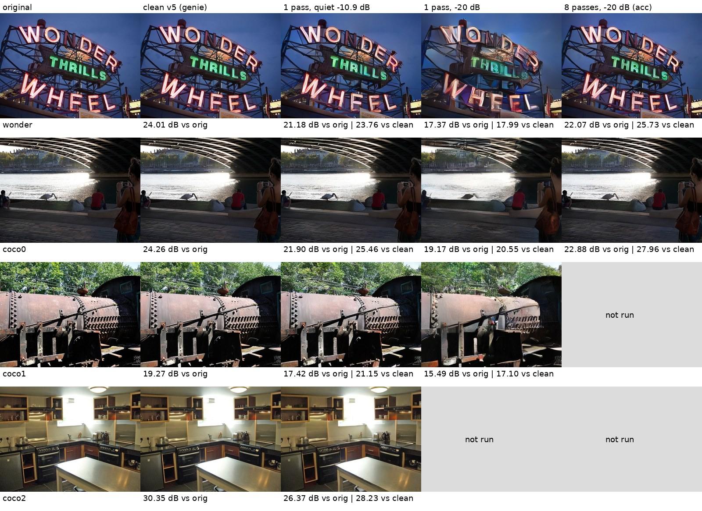

# QRSSTVAE: slow, narrow SSTVAE pictures for HF

QRSSTVAE is an experimental branch of SSTVAE (branch `qrss`). It sends a
picture the way a QRSS beacon sends a callsign: very slowly, in a very
narrow signal, repeated many times. It uses SSTVAE's published v5 image
codec unchanged. A picture is encoded once into about 50,000 analog
numbers ("latents"). Each 30-minute pass sends them on one carrier about
50 Hz wide, starting on a quarter hour. The station repeats the same
picture over hours or days. The receiver averages every pass it hears
into one accumulator per (callsign, picture ID), so the picture builds up
from signals well below the noise.

The waveform built so far is **CE**: a constant-amplitude carrier whose
phase carries the latents. It is meant for an Si5351 clock-chip beacon
that can only set frequency and phase, and it can also be played through
an SSB rig as audio. A second waveform, L, for linear SSB rigs, is
specified but not built.

| | SSTVAE | QRSSTVAE (this branch, waveform CE) |
|---|---|---|
| Codec | v5 neural encoder and decoder | The same v5 codec, unchanged |
| Signal | 24 OFDM carriers, about 1.2 kHz wide | One phase-modulated, constant-amplitude carrier, about 50 Hz wide (99% of power in 51.5 Hz) |
| Time per mode A picture | 32 s | One pass of 1782.7 s (29 min 43 s), starting 1 s after a quarter hour |
| Signals per 2.4 kHz channel | 1 | Up to about 48 CE signals at 50 Hz spacing |
| Repeats | Each transmission decodes on its own | Passes of the same picture are averaged |
| Identification | Callsign in the beacon carrier, optional CW ID after | Callsign in the header, and in Morse in four 11.6 s windows per pass, one every 7.5 minutes |
| Transmitter | SSB rig and sound card | SSB rig and sound card, or an Si5351 board with a microcontroller |
| Status | Used on the air | Simulation only |

[HOW_IT_HEARS.md](HOW_IT_HEARS.md) explains how the receiver works in plain
language. The full design is in [docs/qrss/design.md](design.md). It implements
the draft spec **"QRSSTVAE: ultra-slow narrowband SSTVAE for HF", rev 9**
(`qrsstvae-options.md`, kept outside this repository). Where the design
had to decide something the spec left open, the design's section 14
lists the decision.

## Status

**Everything here has been verified in simulation only.** Nothing has
been transmitted, no Si5351 board has been built, and no recording from a
real receiver has been decoded. All numbers in this document come from
the channel simulator in this branch.

- The on-air format is a draft. Expect incompatible changes.
- Both stations need the same v5 codec checkpoint (codec ID `d1d8`).
  The decoder refuses a picture with a different codec ID unless you pass
  `--any-codec`.
- Live receive works from audio piped into `qrss_listen.py`, and the
  desktop app has a **QRSS signals** window that runs it on the app's
  own capture audio (see "Listening live" below). Both are checked by
  replaying simulated recordings only, never on a radio.
- There is no QRSS waterfall of its own; the app's waterfall shows the
  passband as usual.
- The work covers spec build steps 2 (waveform CE, channel simulator,
  single-pass receiver) and 4 (multi-pass combining, association, EM),
  plus a portable C reference of the beacon's phase generator.

## Quick start

You need the repository's Python environment with the `cli` extras
(onnxruntime). No torch is needed. The examples below assume a checkout
in the current directory and use the `.venv` interpreter.

`--model DIR` points at a directory of exported v5 `.onnx` files. Without
it, the published ONNX artifacts are downloaded and cached on first use.

**1. Encode a picture once.** This writes a stored picture (`.qrsp`) and
prints its picture ID. Every later pass sends these same stored latents.
Do not re-encode a picture you are already sending, because a re-encode
is a different picture under the same ID.

```sh
.venv/bin/python qrss_encode.py photo.jpg pic.qrsp --mode A
# wrote pic.qrsp: mode A (1 segment), codec d1d8, picture ID 7b202aad
```

**2. (Optional) Make a beacon file** for an Si5351 board. It holds one
segment: the coded header bits, the callsign's Morse keying and the
latents as int8. A full segment is 50,970 bytes, which fits a 24LC512
EEPROM.

```sh
.venv/bin/python qrss_beacon.py pic.qrsp seg0.bin --callsign N0CALL --grid FN42
```

**3. Write transmit audio for one slot.** The slot is a quarter hour in
UTC. The scrambler depends on the slot, so a WAV is valid for that
quarter hour only. The WAV is 8 kHz and starts 12 s before t0 (t0 is the
quarter hour plus 1 s), so playback must start 11 s before the quarter
hour. It ends 3 s after the frame.

```sh
.venv/bin/python qrss_transmit.py pic.qrsp tx.wav --slot 2026-10-09T06:00Z --callsign N0CALL --grid FN42
# or from the beacon file, which already carries callsign, grid and keying:
.venv/bin/python qrss_transmit.py seg0.bin tx.wav --slot 2026-10-09T06:00Z
```

**4. Simulate a channel.** This takes the transmit WAV (or a `.qrsp` or
`.bin` directly) and writes what a receiver would record.

```sh
.venv/bin/python qrss_simulate.py tx.wav rx.wav --slot 2026-10-09T06:00Z --snr -10.9 --preset quiet --seed 11
```

**5. Receive the slot.** This finds every CE signal in the recording,
tracks and demodulates it, reads the header and callsign windows, and
stores the pass in the multi-pass store.

```sh
.venv/bin/python qrss_receive.py rx.wav --slot 2026-10-09T06:00Z
```

Example output (from the end-to-end run, quiet path at −10.9 dB):

```
pass 1990584_1499968_28b521d4
  frequency   1499.968 Hz   offset  1499.968 Hz   drift +0.000 Hz/min   wander 0.039 Hz rms
  doppler    0.173 Hz   clock -0.2 ppm   Z_ref 128.0   SNR2500 -11.2 dB   kappa 0.92
  header     N0CALL FN42 picture 7b202aad mode A segment 0 codec d1d8
  callsign   N0CALL   match Z 239.3   keying fsk   agrees
  mean W     +4.71 dB
  stored     N0CALL 7b202aad by header
```

"mean W" is the receiver's estimate of SNR per latent. The spec's "good
picture" target is +2.2 dB per latent for mode A.

**6. Decode the accumulated picture.** Repeat steps 3 to 5 for more slots.
Each received pass of the same (callsign, picture ID) is added to one
accumulator. Then:

```sh
.venv/bin/python qrss_decode.py --list
.venv/bin/python qrss_decode.py out.png --key N0CALL:7b202aad
```

## Listening live

`qrss_listen.py` takes raw mono 8 kHz audio on stdin and keeps a tile
for every CE signal it hears. A signal appears about 25 s after its
quarter hour, once its preamble has arrived. Its tile is received again
every `--refresh` seconds (default 60) with everything heard so far, so
the callsign and picture ID appear after about a minute and the picture
fills in through the pass. When the frame ends, the whole slot is
received again, stored and associated, and the tile shows the picture
accumulated over every pass of it.

Under each tile's picture a 2-pixel band shows that pass's confidence
over time, from the start of the pass at the left to its end at the
right: the per-latent SNR of the picture numbers sent in each ~15 s
stretch (and, for the header's first 80 s, of the header symbols).
Black is no better than noise (-10 dB or less), then blue (-5 dB), red
(0 dB), yellow (+5 dB) and white (+10 dB or more); a single pass needs
around +2 dB on average for a good picture. Grey marks a stretch with
nothing to measure (the preamble, or audio the listener did not hear),
and the band grows as the pass arrives. The values are the tile's
`confidence` in `state.json`, 120 bins in dB, null where there is
nothing to say.

From the desktop app: **View > QRSS signals**, then **Start listener**,
and press **Listen** in the receive pane so there is audio to hear. The
window pipes the receive pane's audio into the listener and shows its
tiles. It finds `qrss_listen.py` and the repository's `.venv` by
walking up from the executable (`native/build/sstvae-gui` in a checkout).
The command line is editable, and `SSTVAE_QRSS_LISTEN` sets its default.
While the app transmits, no audio reaches the listener; the gap is
erased from every pass it touches.

From a terminal, with any capture tool:

```sh
arecord -q -f S16_LE -r 8000 -c 1 -t raw | .venv/bin/python qrss_listen.py --format s16
parec --rate 8000 --channels 1 --format float32le | .venv/bin/python qrss_listen.py
```

The audio is stamped with the computer's clock as it arrives, so the
clock must be right to about a second (NTP). The tiles go to
`~/.local/share/qrsstvae/live` (`--state DIR` to change it), and the
desktop window shows that directory whether or not it started the
listener. One listener writes to a directory at a time: a second one on
the same tiles stops with a message (stop the window's listener first to
show a replay there, or give the replay its own `--state DIR`), and a
second one on the same store runs without a store.

A signal is found on its preamble, so a listener started after a slot's
preamble shows nothing for that slot until the slot ends. A listener
with a passband store (the default) therefore reads the last 36 minutes
back from it when it starts, so restarting the app or the listener
loses nothing an earlier listener heard. A slot's latents are stored only
when its frame ends (5 s after 100%, then up to about 3 minutes of
receiving), so a listener stopped before that, say just before a
quarter hour, would lose them; on its next start a listener therefore
also receives, from the passband store, every slot that ended in the
last 3 hours (`--recover-hours`, 0 for none) that it had heard at least
half of and that no listener finished. These run one at a time, newest
first, whenever no live receive is waiting. The app stops receiving while
it transmits (half duplex), so the listener never hears the app's own
QRSS passes.

A tile whose header has not decoded (not yet, or never) still gets a
picture, marked "no header yet": it assumes the first pass of a mode A
send, which is right for every mode A send and the first pass of B and
C, and noise for the later passes. It is never combined with earlier
passes, and it is redrawn properly once a header decodes.

A replay of a recording runs through the same code faster than real
time, which is how this was tested:

```sh
.venv/bin/python qrss_listen.py --wav rx.wav --slot 2026-10-09T06:00Z --refresh 300
```

Measured on the simulated -10 dB pass from the quick start (FULL frame,
4 shared CPUs): the header decoded at the first receive with a header,
about 60 s in. Each live receive took about 20 s for one signal, and the
final receive about two minutes. With 31% of the latents heard, v5's
picture is not yet recognizable on that test picture. v5 was not trained
for partial passes (spec section 11). At the end of the pass the tile
showed the whole pass: SNR -10.4 dB, mean W +5.4 dB, and the picture
correct by eye.

**Limits of the live view**

- A signal that starts before the listener did is not seen live. Its
  preamble is gone, so only the end-of-slot whole-slot search can find
  it, and that search runs only when at least half the slot was heard.
- The whole-slot search verifies at most 12 candidates, strongest
  first, for at most 3 minutes. On a busy phone band, voices and
  carriers make candidates that each cost about a minute of CPU to
  reject (measured on voice-like audio). Without these limits the search
  on Hamlet ran for over 11 minutes. A weak real signal ranked below
  such candidates can be missed.
- A pass without a header that is stronger than -6 dB is dropped. A
  header decodes far below that, so such a pass is a carrier or a voice.
- Receives run on a worker thread. The listener keeps taking audio and
  updating `state.json` while one runs, and the window shows what the
  worker is doing.
- With continuous audio, each slot's capture also holds half of each
  neighbouring slot's transmissions (FULL frames last two quarter
  hours). The whole-slot search can lock onto a neighbour's carrier at
  the wrong timing. A pass with no header within 20 Hz of a signal of
  another slot that did decode its header is therefore dropped. A real,
  very weak second station that close is dropped with it.
- CPU: roughly 20 s per signal per refresh on a desktop. With many
  signals, use a longer `--refresh`.

## Sending from the app

The desktop app's transmit panel lists three QRSS modes after the
SSTVAE ones: **QRSS CE Mode A - 30 min**, **B - 60 min** and
**C - 90 min**. One pass carries one 50,600-latent group and lasts
1782.7 s, so mode A is one pass, B two and C three, a half hour apart.
With a QRSS mode selected, the **QRSS carrier** slider beside Level sets
the audio frequency the signal goes out on (300-2700 Hz; Page Up/Down
moves 50 Hz, about one CE channel). It is disabled for SSTVAE modes.

Send composes the picture as usual, then:

1. runs `qrss_encode.py --mode A|B|C` on it once (a stored picture);
2. runs `qrss_transmit.py` for the first pass's slot and segment with
   your callsign (and your grid, when it is a locator), a minute before
   that pass (about 7 s on a desktop, 57 MB of temporary audio), and
3. keys the radio 11 s before each pass's quarter hour, with the same
   PTT lead, tail and watchdog as an SSTVAE send, and plays the pass.
   The next pass's audio is made and read in while this one plays,
   because the passes follow each other with only about 2 s between
   one's audio and the next one's.

The first pass takes the first quarter hour at least 11 s plus a minute
away. Every pass carries its own Morse callsign windows (spec 2.7), so
the SSTVAE CW ID and VOX leader are not added. Receive is paused from
Send to the end of the last pass; Cancel stops at once, keyed or not.
A callsign is required. The app looks for the scripts beside its
executable and up to four directories above it; set `SSTVAE_QRSS_DIR`
(and `SSTVAE_QRSS_PYTHON`) otherwise. The computer's clock must be right
to about a second.

### Scheduling sends

**Schedule...**, beside Send, opens the QRSS schedule window. An entry
is one picture, one QRSS mode and one carrier, sent a number of times
(or until removed) from a chosen quarter hour:

- **Picture**: a snapshot of the composition on the Transmit pane (taken
  when the window opens or when you press *Use the composition*), or a
  picture file. A file that is not exactly 640×480 opens the same
  *Frame picture* dialog the Transmit pane uses, and *Framing...*
  re-opens it. The snapshot is stored with the schedule, so later edits
  on the Transmit pane do not change it.
- **First send (UTC)**: a date and a quarter hour, with your local time
  in brackets.
- **Repeat**: how many sends, and how far apart their starts are. *Back
  to back* starts the next send the half hour after the last pass of
  the one before, so two mode A sends back to back ("2 x A") are two
  passes, half an hour apart, both carrying the picture's first part.
  *2 hours (alternating hours)* sends every other hour. Back-to-back
  sends need a count and are limited to a day on the air (48 passes);
  a repeat must be at least as long as the mode's own send.

Every send of an entry is the same picture in the same mode, so it has
the same picture ID and receivers add the passes together.

The window shows what each choice means before you add it (the send
times and the total time on the air), and refuses an entry whose sends
would need the transmitter while another entry's do: one entry's
back-to-back sends go out as one run, but a different picture needs
about four minutes to encode and make its first pass, so two entries
need at least a quarter hour between one's last pass and the other's
first. *Coming up* lists the next sends across all entries; entries can
be paused, resumed and removed.

Scheduled sends go out only while the app is running. Each one starts
four minutes before its first pass's audio, through the same radio,
level and callsign as Send, and receive pauses from then until its last
pass ends. A send that cannot start by 90 s before its audio (the app
was closed, or the transmitter was busy with a send by hand) is
skipped and logged as missed; Send warns before starting a send by hand
that would run over a scheduled one. Cancel during a scheduled send
stops it, including the rest of a back-to-back run; the schedule then
carries on with its next send. The schedule is kept in
`qrss_schedule.json` beside the app's `config.json`, with its pictures
in `qrss_schedule/`.

## The command-line tools

Flags are listed as defined in each script's argparse. Run any script
with `--help` for the full text.

### `qrss_encode.py IMAGE OUTPUT.qrsp`

| Flag | What it does |
|---|---|
| `--mode {A,B,C}` | A sends latent group 0, B groups 0–1, C groups 0–2. Each group is one segment and needs its own slot. Default A |
| `--model` | Codec model: a directory of `.onnx` files, a single `.onnx`, or a `.pt` checkpoint (needs torch). Default: published artifacts |
| `--precision` | ONNX precision of the encoder. Default fp16 |
| `--codec-id HEX` | 16-bit codec ID for a model without `sstvae.source_sha256` metadata. Without metadata or this flag, the encoder refuses |

### `qrss_beacon.py INPUT.qrsp OUTPUT.bin`

| Flag | What it does |
|---|---|
| `--callsign` | Required. 1–8 characters of A–Z, 0–9 and `/`. Sent in the header and in Morse in every callsign window |
| `--grid` | 4-character Maidenhead locator, sent in the header |
| `--segment` | Which segment of the picture (default 0) |
| `--ook` | Identify by on-off keying instead of frequency-shift keying. Stored in the file's flags |

### `qrss_transmit.py INPUT OUTPUT.wav`

INPUT is a `.qrsp` or a beacon `.bin`.

| Flag | What it does |
|---|---|
| `--slot` | Required. Quarter hour in ISO UTC, e.g. `2026-10-09T06:00Z` |
| `--callsign`, `--grid`, `--segment` | For a `.qrsp` input. A `.qrsp` needs `--callsign`, because every pass must key the callsign windows |
| `--freq` | Audio carrier frequency in Hz. Default 1500 |
| `--lead-in S` | Seconds (0–10) of plain carrier before the preamble |
| `--ook` | On-off keyed callsign windows, for a `.qrsp`. A `.bin` carries its own choice, and `--ook` with an FSK `.bin` is refused |
| `--frame` | Frame shape: `full` (default), `medium`, `short` or `tiny`. Anything but `full` is a test frame |
| `--float` | Write float32 with no normalisation, for exact round trips. Default is peak-normalised int16 |

### `qrss_simulate.py INPUT OUTPUT`

INPUT is a `.qrsp`, a `.bin`, or a transmit WAV. OUTPUT is a `.wav`
(8 kHz audio starting `--pre` seconds before t0) or an `.npz` with the
receiver front-end samples and the channel's truth arrays, for scoring a
receiver.

| Flag | What it does |
|---|---|
| `--slot` | Required. Quarter hour in ISO UTC |
| `--callsign`, `--grid`, `--segment`, `--freq`, `--frame`, `--lead-in`, `--ook` | As for `qrss_transmit.py`, used when INPUT is a `.qrsp` or `.bin` |
| `--snr` | SNR in 2500 Hz in dB, measured on the wanted signal's keyed samples. Default: no noise |
| `--preset` | Watterson path: `steady`, `quiet` (0.1 Hz Doppler spread, 0.5 ms delay), `moderate` (0.5 Hz, 1 ms), `disturbed` (1 Hz, 2 ms), `mps` (0.15 Hz, 2 ms) |
| `--doppler`, `--delay` | Doppler spread (Hz, 2σ) and second-path delay (ms), instead of a preset |
| `--offset` | Frequency offset, Hz |
| `--drift`, `--drift-tau` | Drift in Hz/min; with `--drift-tau` it becomes a warm-up that settles with that time constant |
| `--wander`, `--wander-tau` | Random frequency wander, Hz rms, and its correlation time (default 10 s) |
| `--tx-ppm`, `--rx-ppm` | Transmit and receive sample-clock errors |
| `--impulse-rate`, `--impulse-db` | Clicks per second and their level over the signal (default 30 dB) |
| `--crashes` | Static crashes per minute |
| `--agc` | Fast receive AGC (2 ms attack, 200 ms decay) |
| `--neighbour DF:DB` | Another CE station DF Hz away at DB relative to this one. Repeatable. `DF:DB:LEADIN:DRIFT` also sets its lead-in seconds and drift |
| `--pre`, `--post` | Seconds before t0 and after the frame in the output (default 12 and 3) |
| `--seed` | Random seed (default 0) |
| `--float` | float32 WAV, not normalised |

### `qrss_receive.py INPUT`

INPUT is an 8 kHz WAV of one slot, or a `qrss_simulate.py` `.npz`.

| Flag | What it does |
|---|---|
| `--slot` | Quarter hour in ISO UTC. Needed for a WAV; an `.npz` carries its own |
| `--start` | UTC time of the WAV's first sample. Default: t0 − 12 s, as `qrss_transmit.py` and `qrss_simulate.py` write it |
| `--frame` | Frame shape. Default `full`, or the `.npz`'s own |
| `--store DIR` | Multi-pass store. Default `$QRSSTVAE_HOME` or `~/.local/share/qrsstvae` |
| `--no-store` | Do not store or associate the passes |
| `--passband DIR`, `--no-passband` | Where to keep the slot's front-end stream for 48 hours (default `STORE/passband`), or do not keep it. `qrss_decode.py --retro` searches it later |
| `--estimator {joint,plain}` | Per-block data estimator. Default `joint` |
| `--image PNG` | Render the first pass's picture on its own (FULL frames with a decoded header only) |
| `--model`, `--precision` | Codec for `--image`. Precision default fp32 |

### `qrss_decode.py [OUTPUT.png]`

Exactly one of `--key`, `--pass` or `--list`.

| Flag | What it does |
|---|---|
| `--key CALL:PICTUREID` | Render the accumulator for that callsign and picture ID (hex) |
| `--pass FILE.npz` | Render one stored pass. It needs a decoded header |
| `--list` | List the store's pictures and their passes, then exit |
| `--store DIR` | Multi-pass store, as for `qrss_receive.py` |
| `--em ROUNDS` | Run that many rounds of leave-one-out EM over the passes before decoding (re-tracks each pass with the others as reference). Default 0 |
| `--retro` | With `--key`: first search the 48 h passband store for passes of this picture that were too weak to detect when they arrived |
| `--passband DIR`, `--frame` | Passband store and frame shape for `--retro` |
| `--any-codec` | Decode even if the picture's codec ID does not match the decoder's |
| `--model`, `--precision` | Codec model and precision. Precision default fp32 |

## Callsign windows and lead-in

**Callsign windows.** Amateur rules require identification at least every
10 minutes. Every CE pass therefore has four callsign windows of 11.64 s
(384 symbols) each. They start 421.0, 871.0, 1321.0 and 1771.0 s after
t0, and the last one ends the pass. Because every station uses the same
positions, all stations' windows fall at the same moments on the clock:
07:02, 14:32, 22:02, 29:32, 37:02, 44:32, 52:02 and 59:32 past the hour.
A window carries the header's callsign in international Morse at 19.8
wpm, starting 8 units in, with plain carrier before and after.

Two keyings are available. The receiver accepts both.

- **FSK (default).** Key-down is the carrier shifted 16.495 Hz down, with
  each change smoothed over one Morse unit. The phase at the end of the
  window is where it would have been without the window, so the
  receiver tracks straight through. It is meant for software, not ears: a
  16.5 Hz shift is hard to hear or see on a waterfall.
- **OOK** (`--ook`). The carrier is switched on and off. It stays on for
  units 0–4 and 184–191, is off for units 5–7, and is on only for
  key-down from unit 8. An Si5351 keeps running and only its output is
  switched, so the phase is kept. This is for operators whose rules
  require on-off keyed CW for identification. Its unshaped keying spreads
  clicks into neighbours' windows (spec estimate about −22 dB into a CE
  signal 50 Hz away), never into their data.

**Lead-in.** `--lead-in S` sends up to 10 s of unmodulated carrier before
the preamble, for transmitters that drift when they key up. The carrier
runs phase-continuously into the preamble. It is not flagged in the
header and adds nothing to the picture. The receiver must and does decode
the same with or without it.

## The Si5351 C reference (`qrss_beacon_c/`)

`qrss_beacon_c/` is a portable C99 reference of what a CE beacon has to
compute. It reads a beacon file and produces the transmit phase and the
Si5351 frequency steps. It is not firmware. It has no I2C driver, no
clock handling and no main loop for a microcontroller. Its purpose is to
be the bit-exact reference ("parity oracle") that any port is tested
against.

What it does:

- No dynamic allocation; integer arithmetic only. Phase is a `uint32_t` in
  2^−32 turn, so it wraps like a synthesizer's phase accumulator.
- It computes on the device everything not in the beacon file: the
  preamble, reference symbols and per-slot scrambler (by SHA-256, with
  the included `sha256.c`), the precoder (sign flips and a 64-point
  Walsh-Hadamard transform per block), the phase pulse sum and the
  callsign-window phase.
- `qrss_si5351_next()` gives the frequency of each update interval in
  steps of a chosen size, with error feedback so the phase reached tracks
  the target phase.
- `qrss_ce_keyed()` says when the output should be on, including OOK
  callsign windows.
- `qrss_tables.h` (pulse table in Q14, Hann integral, scale constants,
  frame presets) is generated by `tools/gen_qrss_tables.py`.
- About 1,150 lines including the test driver. On x86-64 with `-O2`,
  `qrss_ce.o` plus `sha256.o` is about 9.2 KB of code, and the state
  struct `qrss_ce_t` is 632 bytes. Sizes on AVR or ESP32 have not been
  measured.

Build and test:

```sh
cd qrss_beacon_c
make                  # builds build/qrss_ce_test
make check            # SHA-256 self-test against FIPS 180-4
make tables           # regenerate qrss_tables.h from sstvae/qrss
./build/qrss_ce_test show seg0.bin 1990584    # frame summary, first phases and 0.4 Hz steps at 990 Hz
```

The second argument of `show` is the slot number q = floor(unix time of
the quarter hour / 900). The Python tests compare the C output with the
Python modulator:

```sh
.venv/bin/python -m pytest tests/test_qrss_c_ref.py
```

They check the sequences bit for bit (C1), the phase within 2e-4 rad rms
and 1e-3 rad max over the first 600 s of a beacon file for both keyings
and several update rates (C2), identical Si5351 steps (C3), rejection of
bad files, that the generated tables are current, a build under
UndefinedBehaviorSanitizer, and that no shift relies on `int` being
wider than 16 bits (as it is not on AVR). The tests skip if no C compiler
is found.

**What an AVR or ESP32 port must supply.** The reference leaves these to
the port:

- **Storage access to the beacon file.** `qrss_ce_init()` takes the whole
  50,970-byte file as an in-memory pointer, and the code reads latents
  and header bits through it. An AVR with a 24LC512 EEPROM needs those
  reads replaced with EEPROM reads (with some caching). An ESP32 can keep
  the file in flash.
- **UTC time.** The slot number q and t0 (quarter hour + 1 s) must be
  known to well under a symbol (30.3 ms). Sources the spec names: GPS,
  NTP or a real-time clock.
- **A timer for the update rate** (the tests use 990, 250 and 125 Hz),
  calling `qrss_si5351_next()` once per update and writing the result.
- **The Si5351 driver:** I2C, PLL and multisynth setup, and applying a
  frequency of carrier + n × step at each update, where the step size
  (0.4 Hz in the tests) depends on how the Si5351 is configured.
- **Output enable** for keying: on from t0 − 8T (or earlier for a
  lead-in) to the end of the frame, and the OOK window keying from
  `qrss_ce_keyed()`. The oscillator should keep running between passes.
- **Frequency choice and calibration.** The spec asks a beacon to pick a
  random spot in the channel on every pass and to calibrate its
  reference to about 1 ppm.
- **64-bit integer arithmetic** (`int64_t`), which avr-gcc provides in
  software.
- The RF side: low-pass filter, and an amplifier if wanted.

## Measured results (simulated)

**Every number in this section is from simulation.** None is from a real
radio path, a real receiver or real hardware.



*Simulated.* Columns: original; clean v5 decode of the stored latents;
one pass on a quiet path at −10.9 dB; one pass at −20 dB; eight passes at
−20 dB combined. PSNR is against the original and against the clean v5
decode. "Not run" cells were skipped for time.

### End-to-end through the command-line tools (simulated)

One FULL slot per case, run through `qrss_encode` → `qrss_transmit`
(callsign N0CALL, FN42, 8 kHz WAV) → `qrss_simulate` (WAV in, WAV out) →
`qrss_receive` → `qrss_decode --key`, on four 640×480 pictures (three
COCO validation pictures and `wonder_wheel.jpg`). Each case used one
seed. SNR is in 2500 Hz.

- **Acquisition, header and callsign.** 32 of 32 passes were found, their
  header decoded and associated by header, including every −20 dB pass.
  The callsign window was read correctly in all 15 single-pass cases at
  −10 to −11 dB, with both FSK and OOK keying. At −20 dB it was read in
  only 2 of 17 passes, but the callsign match test agreed in all 17.
- **Per-latent SNR (mean W) in one pass:**

  | Path | SNR set | Mean W measured | AWGN expectation |
  |---|---|---|---|
  | quiet | −10.9 dB | +4.3 to +4.7 dB | +5.4 dB |
  | disturbed | −10.5 dB | +2.34 to +2.39 dB | +5.7 dB |
  | quiet plus ±400 Hz offset, 1 Hz/min drift, 0.3 Hz rms wander, ±100 ppm clocks, 2 crashes/min, fast AGC | −10 dB | +4.6 to +4.9 dB | +6.1 dB |
  | quiet | −20 dB | −3.2 to −3.6 dB | −3.0 dB |

  The spec's "good picture" target is +2.2 dB. The weights are
  calibrated: mean(w·e²) against the true latents was 0.97 to 1.07.
- **Lead-in (10 s), OOK and transmitting from the beacon file** all
  worked (wonder picture only), with W and PSNR within the spread of the
  plain quiet case.
- **Multi-pass.** Eight passes at −20 dB (about −3.4 dB per latent each)
  combined to +5.6 dB mean W, which is the ideal 10·log10(8) = 9 dB gain.
  The eight-pass picture was better than one pass at −10.9 dB:

  | Picture | 1 pass, quiet −10.9 dB (PSNR vs original) | 1 pass, −20 dB | 8 passes, −20 dB | Clean v5 decode |
  |---|---|---|---|---|
  | wonder | 21.18 dB | 17.37 dB | 22.07 dB | 24.01 dB |
  | coco0 | 21.90 dB | 19.17 dB | 22.88 dB | 24.26 dB |

  One pass at −10.9 dB was 1.9 to 3.9 dB of PSNR below the clean v5
  decode, across the four pictures.
- **`--em 1`** on the eight wonder passes changed nothing (mean W +5.64 dB
  before and after) and took 229 s.
- **The receiver's SNR estimate reads low**, 0.3 to 0.9 dB below the
  simulator's setting in every case.
- **Run time.** One FULL receive takes about 54 s on its own on a shared
  4-CPU machine, and 42 to 266 s with other jobs running. Encode is about
  1.5 s, transmit about 5 s, simulate about 11 s and decode 2 to 5 s.

### From the test suite (simulated)

The slow tests (`-m slow`) print their measurements. Highlights, taken
from the test files:

- **Header.** The polar-coded header decodes in at least half of the
  passes at −23.5 dB in one pass (R17), and four passes' soft header
  information summed decodes at −29 dB.
- **Detection.** The preamble detector finds about 97% of SHORT
  preambles at −28 dB on a steady path (78/80), and 21/40 at −31 dB. The
  whole-slot search finds FULL passes at −34 dB on a steady path in 5 of
  6 seeds; on a quiet fading path at −34 dB it found 0 of 10 (an open
  item, below).
- **Multi-pass thresholds** (P3, mean W reaching +2.2 dB, quiet path):
  2, 4, 8 and 16 passes at about −16.1, −19.9, −23.3 and −26.4 dB pass
  their tests, as does 16 passes on a moderate path at −25.7 dB. These
  runs hand the receiver the nominal frequency and timing, as the
  template search would once an accumulator exists.
- **Single-pass thresholds** (design 10.8, per-latent SNR from the
  LMMSE error): quiet −10.9 dB gives +2.69 dB, moderate −10.7 dB gives
  +2.26 dB, steady −14.9 dB gives +1.75 dB.
- **Si5351 synthesis model.** With 0.4 Hz frequency steps, the phase
  error after the matched filter is 67.3, 44.7 and 33.0 dB below the
  signal at 990, 250 and 125 Hz update rates (frequency 7.6 Hz rms, 27 Hz
  maximum).
- **All steady-path impairments at once** (+400 Hz, 1 Hz/min, 0.5 Hz rms
  wander, ±100 ppm, clicks and crashes, fast AGC, 10 s lead-in, SHORT
  frame, −12 dB): the weights stay honest, but per-latent SNR is about
  2 dB under the closed form, more than the separate losses add up to.

To run the QRSSTVAE tests:

```sh
.venv/bin/python -m pytest tests/test_qrss_*.py              # fast suite
.venv/bin/python -m pytest tests/test_qrss_*.py -m slow -s   # slow suite, prints measurements
```

Codec tests look for the v5 models in `$QRSSTVAE_MODEL_DIR` and skip if
none are found; they never download.

## Known limitations and open items

These are recorded as expected failures (`xfail`) in the tests, with the
measured numbers. All are simulated.

- **Disturbed paths (1 Hz Doppler) fall short of the spec.**
  - 16 passes at −25.1 dB give mean W −3.40 dB instead of +2.2 dB: at
    −25 dB per pass the tracker loses the fading path, which the spec's
    model does not account for.
  - One pass at −10.5 dB gives a median per-latent SNR of +1.66 dB,
    0.04 dB under the +1.7 dB floor; the receiver is about 0.5 dB short
    of the spec's fading-loss model on this path.
- **Frequency wander costs more than budgeted.** With 0.1 Hz rms wander
  the loss is 0.39, 0.34 and 0.12 dB at correlation times 3, 10 and
  60 s, against a 0.1 dB budget. With 0.5 Hz rms at 3 s it is 0.61 dB
  against 0.5 dB.
- **Weak-pass detection on fading paths.** On a quiet path at −34 dB the
  whole-slot search found 0 of 10 FULL passes; the verification
  statistic is about 4 even at the true timing and frequency, under the
  gate of 6.
- **OOK callsign reading is weaker than FSK.** One window at −10 dB read
  correctly in 3 of 10 trials with OOK, against 10 of 10 with FSK. (In
  the single OOK end-to-end case, at −10.9 dB, the callsign was read
  correctly, and the match test against the header works for both.)
- **Callsign windows cost the tracker a little.** Data within 10 s of a
  window lose 0.20 dB against the genie receiver, against 0.04 dB
  elsewhere (budget: 0.1 dB extra).
- **Association.** A pass whose header could not be decoded can stay
  "provisional" even after later passes decode the header, because
  nothing re-tests it (measured at −30 dB). Separately, one transmission
  sometimes produces a spurious second pass that gets attached to the
  accumulator by correlation (SHORT frames, end-to-end CLI test).
- **EM refinement gains little.** Leave-one-out EM gives +0.0 to
  +0.15 dB on a quiet path (spec target +0.5 dB) and nothing measurable
  on a disturbed path (effective SNR 2.89 → 2.86 dB). The spec's own
  tracking model says there is under 0.1 dB to recover on these paths.
  A noise-only pass's W fluctuates by ±3 dB between re-receives, so the
  "noise passes do not gain from EM" test cannot be met as written.
- **Decoded PSNR vs a noise-on-latents reference.** At the measured
  per-latent SNR, the decoded picture is 0.41 dB worse on average than
  adding the same noise directly to the true latents; three of five
  pictures are 0.05 to 0.27 dB past the 0.5 dB bound.
- **Spectrum far skirt.** At 80 Hz from the carrier the sideband
  density is −60.4 dB, not the −65 dB the design took from an earlier
  simulation that cut the pulse at ±16 symbols. The normative pulse is
  cut at ±8 symbols.
- **Not built:** waveform L, a QRSS-specific waterfall, and a model
  trained for this mode. The live listener and the app's QRSS window
  are built but untested on a radio.

## Needs hardware or on-air time

None of the following has been done. Each needs equipment or air time
that this work did not have.

- **Spec build step 3: bench test an Si5351 board** on 630 m and on an HF
  band. Synthesize CE with about 1 kHz frequency updates, check its
  spectrum against the spec, check that the simulated receiver decodes
  it, and measure its frequency wander over 3 to 60 s against a
  GPS-disciplined reference, in a box and in open air. This needs a port
  of the C reference to a microcontroller first.
- **Spec build step 5: two-station over-the-air trial** with CE on 630 m
  and on one HF band, using the default schedule of 8 passes a day,
  including a 10 mW Si5351 beacon checked against its own WSPR spots.
- **Real-receiver measurements:**
  - decoding real recordings, from a station receiver or a WebSDR,
    instead of simulated WAVs;
  - real sound-card clock errors, AGC behaviour and impulse noise
    (including lightning crashes on 630 m) against the simulator's
    models;
  - real oscillator wander and warm-up drift of SSB rigs and Si5351
    boards, which the open wander item above depends on;
  - detection and false-alarm rates on real band noise with real
    neighbouring signals;
  - whether the CE signal with FSK or OOK identification is acceptable
    under the operator's licence rules (the spec discusses US 97.119).
